# Arquitectura del Agente de IA para Ventas - Laburen

## Descripción General

El agente de ventas de Laburen es un sistema conversacional basado en IA que permite a los clientes explorar, seleccionar y comprar productos de ropa a través de WhatsApp.

## Diagrama de Arquitectura

```mermaid
flowchart TB
    subgraph Cliente
        WA[📱 WhatsApp]
    end

    subgraph Twilio["Twilio Platform"]
        WAAPI[WhatsApp Sandbox API]
    end

    subgraph Server["Servidor Node.js"]
        WH["/webhook\nEndpoint"]
        AGENT["🤖 Agente IA\n(Gemini 2.5 Flash)"]
        API["API REST"]
        
        subgraph Routes["Endpoints"]
            PROD["GET /products"]
            PRODID["GET /products/:id"]
            CARTC["POST /carts"]
            CARTU["PATCH /carts/:id"]
        end
    end

    subgraph External["Servicios Externos"]
        GEMINI["Google Gemini API\n(Function Calling)"]
    end

    subgraph Database["Base de Datos"]
        PG[(PostgreSQL\nNeon)]
        subgraph Tables
            T1["products"]
            T2["carts"]
            T3["cart_items"]
        end
    end

    WA <-->|Mensajes| WAAPI
    WAAPI <-->|Webhook| WH
    WH --> AGENT
    AGENT <-->|Function Calling| GEMINI
    AGENT -->|HTTP Requests| API
    API --> Routes
    Routes <-->|Prisma ORM v7| PG
    T2 --> T3
    T3 --> T1
```

## Componentes Principales

### 1. Twilio WhatsApp Sandbox
- **Función**: Recibe y envía mensajes de WhatsApp
- **Webhook**: Notifica al servidor cuando llegan mensajes (POST urlencoded)
- **Activación**: Enviar `join <code>` al número de sandbox

### 2. Servidor Node.js + Express
- **Puerto**: 4040 (configurable)
- **Endpoints**:
  | Ruta | Método | Descripción |
  |------|--------|-------------|
  | `/products` | GET | Lista productos con filtros |
  | `/products/:id` | GET | Detalle de producto |
  | `/carts` | POST | Crear carrito |
  | `/carts/:id` | GET | Ver carrito |
  | `/carts/:id` | PATCH | Modificar carrito |
  | `/carts/:id` | DELETE | Eliminar carrito |
  | `/webhook` | GET/POST | WhatsApp webhook (Twilio) |

### 3. Agente de IA (Gemini)
- **Modelo**: Gemini 2.5 Flash
- **Capacidades**: Function Calling nativo
- **Herramientas disponibles**:
  - `searchProducts` - Buscar productos
  - `getProductDetails` - Ver detalles
  - `createCart` - Crear carrito
  - `getCart` - Ver carrito actual
  - `updateCart` - Modificar carrito
  - `clearCart` - Vaciar carrito

### 4. Base de Datos PostgreSQL (Neon)
- **ORM**: Prisma v7 con driver adapter
- **Tablas**: products, carts, cart_items
- **Relaciones**: Cart → CartItems → Product

## Flujo de Datos

1. **Cliente envía mensaje** → WhatsApp → Twilio API → Webhook
2. **Webhook procesa** → Extrae texto (Body, From) → Envía al agente
3. **Agente determina intención** → Llama funciones necesarias
4. **Funciones consultan API** → API accede a PostgreSQL via Prisma
5. **Respuesta formateada** → Agente genera texto → Twilio envía a cliente
