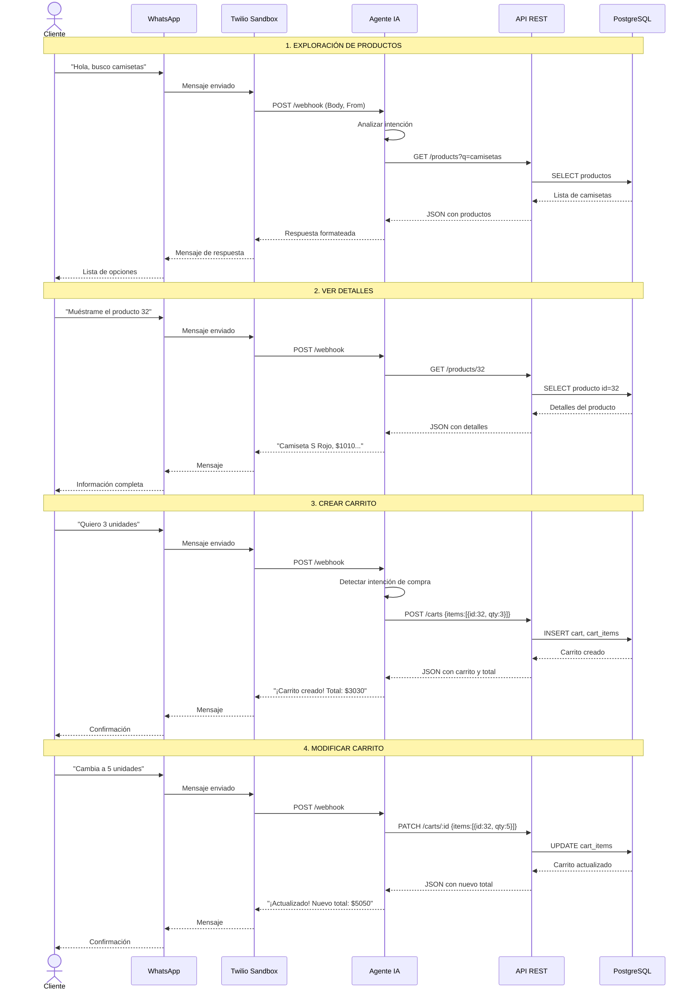

# Diagrama de Flujo de Conversación

## Flujo Principal de Compra

## Estados del Carrito

## Tipos de Intenciones del Usuario

| Intención | Ejemplos | Acción del Agente |
|-----------|----------|-------------------|
| **Saludo** | "Hola", "Buenos días" | Dar bienvenida, preguntar qué busca |
| **Buscar** | "Busco pantalones", "Tienes algo deportivo?" | searchProducts() |
| **Detalles** | "Cuéntame del producto 15", "Qué tallas hay?" | getProductDetails() |
| **Comprar** | "Lo quiero", "Dame 2 unidades" | createCart() o updateCart() |
| **Ver carrito** | "Qué tengo en el carrito?" | getCart() |
| **Modificar** | "Cambia la cantidad", "Quita el producto" | updateCart(qty=0) |
| **Cancelar** | "Borra todo", "Empezar de nuevo" | clearCart() |

## Manejo de Errores

